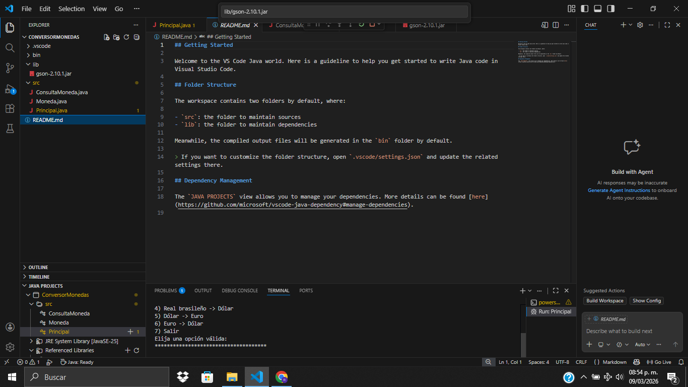

# 💱 Conversor de Monedas

Proyecto desarrollado como parte del **Challenge de Java de Alura ONE**. Este programa permite convertir diferentes monedas utilizando **tasas de cambio en tiempo real** obtenidas desde una API.

---

## 📸 Vista del programa

## 🛠 Tecnologías utilizadas

- ☕ **Java**
- 🌍 **ExchangeRate API**
- 📦 **Gson** (para procesar JSON)
- 🖥 **Java Swing** (para la interfaz gráfica)

---

## 🚀 Funcionalidades

El conversor permite realizar las siguientes conversiones:

- 💵 **USD → ARS** (Dólar a Peso Argentino)
- 🇦🇷 **ARS → USD** (Peso Argentino a Dólar)
- 💵 **USD → BRL** (Dólar a Real Brasileño)
- 🇧🇷 **BRL → USD** (Real Brasileño a Dólar)
- 💵 **USD → EUR** (Dólar a Euro)
- 🇪🇺 **EUR → USD** (Euro a Dólar)

---

## 📋 Cómo usar el programa

El proyecto puede ejecutarse de dos maneras:

### 🖥 Modo consola

1. Ejecuta el archivo **Principal.java**
2. Elige una opción del menú
3. Ingresa la cantidad que deseas convertir
4. El programa mostrará el resultado en la terminal

### 🪟 Modo interfaz gráfica

1. Ejecuta el archivo **VentanaConversor.java**
2. Ingresa la cantidad a convertir
3. Selecciona las monedas de origen y destino
4. Presiona el botón **Convertir**
5. El resultado aparecerá en la ventana

---

## 💡 Objetivo del proyecto

Este proyecto fue creado para practicar:

- Programación orientada a objetos en **Java**
- Consumo de **APIs externas**
- Manejo de **JSON**
- Uso de **bibliotecas externas (Gson)**
- Desarrollo de **interfaces gráficas con Swing**

---

Proyecto realizado con dedicación como parte del programa **Alura ONE - Oracle Next Education**.

[def]: ./image.png